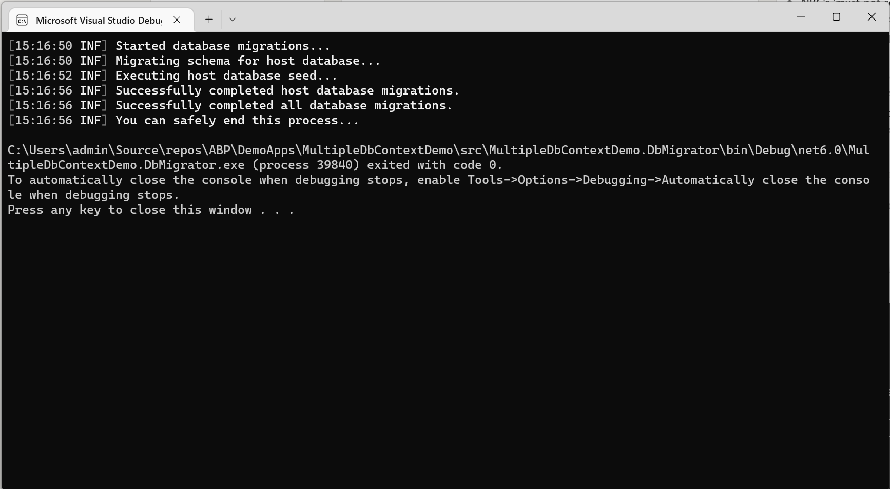
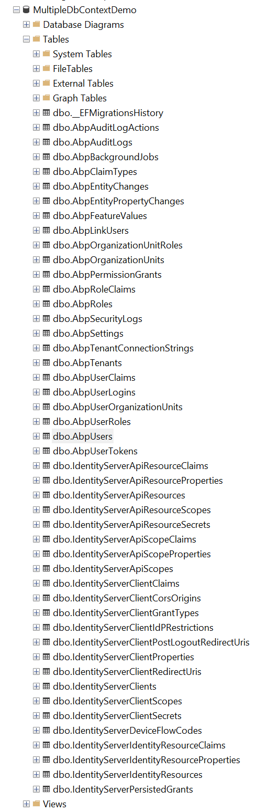
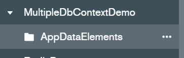
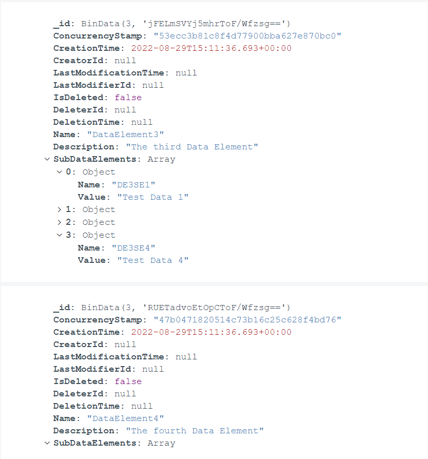

Using Multiple DbContexts within ABP Framework

# Introduction

As your organization grows and becomes more complex, you may find yourself with multiple database platforms servicing different needs. For example, maybe you want to leverage a NoSQL approach on your reporting entities to leverage the speed and dynamic object flexibility of that platform while maintaining your more structured data elements inside a traditional SQL solution. This article is designed to walk you through the basic steps to extend your ABP Framework solution and to take advantage of a multi-database architecture.
## Source Code
The source code for this application can be found on GitHub.

---

# Requirements
The following tools are needed to run the solution:
- .NET 6.0 SDK
- MongoDB Server (with MongoDb Compass)
- SQL Server (with SQL Server Management Studio)

---

# Development
## Create the project
To begin, we are going to create a new ABP Framework project via the command line. Since we are going to use the SQL instance as our default database, we will specify that in the command line:

`abp new MultipleDbContextDemo -t app -u mvc --mobile none --database-provider ef -csf`

## Update the connection strings
In your main Web Project, open the `appsettings.json` file and add update the `ConnectionStrings` object with the appropriate connection strings:

```
"ConnectionStrings": {
    "Default": "Server=localhost;Database=MultipleDbContextDemo;Trusted_Connection=True",
    "Mongo": "mongodb://localhost:27017/MultipleDbContextDemo"
  },
```

Repeat this process for the `appsettings.json` file in the DbMigrator project of the solution.

## Add an Entity type to be handled by the MongoDb
Alright, so we're splitting the DbContexts out for a reason. To simulate this process, we will create an entity that is handled explicitly by MongoDb so we can define it in the DbContext in a little bit. To begin, add a directory under the `MultipleDbContext.Domain` project called `DataElement` and another called `SubDataElement`. This is where we will place the class files that make up our Data elements going into the MongoDb.

### Create the `SubDataElements` class
In the `SubDataElements` directory, create a new class called `SubDataElement.cs` and populate it with the following content:
```
using System;
using System.Collections.Generic;
using System.Linq;
using System.Text;
using System.Threading.Tasks;

namespace MultipleDbContextDemo.SubDataElements
{
    public class SubDataElement 
    {
        public SubDataElement()
        {
        }

        public SubDataElement(string name, string value)
        {
            Name = name;
            Value = value;
        }

        public string Name { get; set; }
        public string Value { get; set; }

        public override bool Equals(object obj)
        {
            SubDataElement subDataElement = obj as SubDataElement;
            
            if(subDataElement == null) return false;
            if (!string.Equals(subDataElement.Name, this.Name, StringComparison.InvariantCultureIgnoreCase)) return false;
            if (!string.Equals(subDataElement.Value, this.Value, StringComparison.InvariantCultureIgnoreCase)) return false;

            return true;
        }
    }
}
```

**Note:** This class will be nested within the `DataElement` class, so we don't need to define an ABP Entity declaration.

### Create the `DataElements` entity
In the `DataElements` directory, create a new class called `DataElement.cs` and populate with the following content:
```
using MultipleDbContextDemo.SubDataElements;
using System;
using System.Collections.Generic;
using System.Collections.ObjectModel;
using System.Diagnostics.CodeAnalysis;
using System.Linq;
using System.Text;
using System.Threading.Tasks;
using Volo.Abp;
using Volo.Abp.Domain.Entities.Auditing;

namespace MultipleDbContextDemo.DataElements
{
    public class DataElement : FullAuditedAggregateRoot<Guid>
    {
        public DataElement()
        {
        }

        public DataElement(string name, string description)
        {
            Name = name;
            Description = description;
        }

        [NotNull]
        public string Name { get; set; }

        [NotNull]
        public string Description { get; set; }

        public ICollection<SubDataElement> SubDataElements { get; private set; } = new Collection<SubDataElement>();


        /* helper methods for handling the SubDataElements collection */
        private bool IsInSubDataElements(SubDataElement subDataElement)
        {
            return SubDataElements.Any(x=>x.Equals(subDataElement));
        }

        public void AddSubDataElement(SubDataElement subDataElement)
        {
            Check.NotNull(subDataElement, nameof(subDataElement));

            if(IsInSubDataElements(subDataElement))
            {
                return;
            }

            SubDataElements.Add(subDataElement);
        }

        public void RemoveSubDataElement(SubDataElement subDataElement)
        {
            Check.NotNull(subDataElement, nameof(subDataElement));

            if (!IsInSubDataElements(subDataElement))
            {
                return;
            }

            SubDataElements.RemoveAll(x => x.Equals(subDataElement));
        }

        public void RemoveAllSubDataElements()
        {
            SubDataElements.Clear();
        }

    }
}
```
**Note:** This is our root entity, and it contains a collection of objects that are NOT defined as entities, so it is more compatible with a schema-less database solution like MongoDb than a heavily schema-based solution like MSSQL.

### Create the `IDataElementRepository.cs` file
In the `DataElements` directory, create a new class called `IDataElementRepository.cs` and add the following content:
```
using System;
using System.Collections.Generic;
using System.Linq;
using System.Text;
using System.Threading.Tasks;
using Volo.Abp.Domain.Repositories;

namespace MultipleDbContextDemo.DataElements
{
    public interface IDataElementRepository : IRepository<DataElement, Guid>
    {
    }
}
```

### Create the `DataElementManager.cs` file
In the `DataElements` directory, create a new class file called `DataElementManager` and add the following content:
```
using MultipleDbContextDemo.SubDataElements;
using System;
using System.Collections.Generic;
using System.Collections.ObjectModel;
using System.Linq;
using System.Text;
using System.Threading.Tasks;
using Volo.Abp;
using Volo.Abp.Domain.Repositories;
using Volo.Abp.Domain.Services;

namespace MultipleDbContextDemo.DataElements
{
    public class DataElementManager : DomainService
    {
        private readonly IDataElementRepository _dataElementRepository;

        public DataElementManager(IDataElementRepository dataElementRepository)
        {
            _dataElementRepository = dataElementRepository;
        }

        public async Task<DataElement> CreateAsync(string name, string description, ICollection<SubDataElement> subDataElements = null)
        {
            Check.NotNull(name, nameof(name));
            Check.NotNull(description, nameof(description));

            var dataElement = new DataElement(GuidGenerator.Create(), name, description);

            if(subDataElements != null)
            {
                foreach(var subDataElement in subDataElements)
                {
                    dataElement.AddSubDataElement(subDataElement);
                }    
            }

            return await _dataElementRepository.InsertAsync(dataElement);
        }

        public async Task<DataElement> UpdateAsync(Guid id, string name, string description, ICollection<SubDataElement> subDataElements = null)
        {
            Check.NotNull(name, nameof(name));
            Check.NotNull(description, nameof(description));

            var dataElement = (await _dataElementRepository.WithDetailsAsync()).Where(x => x.Id == id).FirstOrDefault();

            if (dataElement == null || dataElement == default)
                throw new UserFriendlyException($"Data Element not found with Id: {id}");

            dataElement.Name = name;
            dataElement.Description = description;

            if (subDataElements != null)
            {
                subDataElements = new Collection<SubDataElement>();
                foreach (var subDataElement in subDataElements)
                {
                    dataElement.AddSubDataElement(subDataElement);
                }
            }

            return await _dataElementRepository.UpdateAsync(dataElement);
        }
    }
}
```

### Create the `DataElementDataSeedContributor.cs` file
We want to see the data in action, so create a data seed contributor to add some initial data to the repository. In the `DataElements` directory, create a new file called `DataElementDataSeedContributor.cs` with the following content:
```
using System.Collections.Generic;
using System.Threading.Tasks;
using Volo.Abp.Data;
using Volo.Abp.DependencyInjection;
using Volo.Abp.Guids;

namespace MultipleDbContextDemo.DataElements
{
    public class DataElementDataSeedContributor : IDataSeedContributor, ITransientDependency
    {
        private readonly IDataElementRepository _dataElementRepository;
        private readonly IGuidGenerator _guidGenerator;

        public DataElementDataSeedContributor(IDataElementRepository dataElementRepository, IGuidGenerator guidGenerator)
        {
            _dataElementRepository = dataElementRepository;
            _guidGenerator = guidGenerator;
        }

        public async Task SeedAsync(DataSeedContext context)
        {
            if(await _dataElementRepository.GetCountAsync() == 0)
            {
                var dataElements = new List<DataElement>();

                var de1 = new DataElement(_guidGenerator.Create(), "DataElement1", "The first Data Element");
                de1.AddSubDataElement(new SubDataElements.SubDataElement("DE1SE1", "Test Data 1"));
                de1.AddSubDataElement(new SubDataElements.SubDataElement("DE1SE2", "Test Data 2"));
                dataElements.Add(de1);

                var de2 = new DataElement(_guidGenerator.Create(), "DataElement2", "The second Data Element");
                de2.AddSubDataElement(new SubDataElements.SubDataElement("DE2SE1", "Test Data 1"));
                dataElements.Add(de2);

                var de3 = new DataElement(_guidGenerator.Create(), "DataElement3", "The third Data Element");
                de3.AddSubDataElement(new SubDataElements.SubDataElement("DE3SE1", "Test Data 1"));
                de3.AddSubDataElement(new SubDataElements.SubDataElement("DE3SE2", "Test Data 2"));
                de3.AddSubDataElement(new SubDataElements.SubDataElement("DE3SE3", "Test Data 3"));
                de3.AddSubDataElement(new SubDataElements.SubDataElement("DE3SE4", "Test Data 4"));
                dataElements.Add(de3);

                var de4 = new DataElement(_guidGenerator.Create(), "DataElement4", "The fourth Data Element");
                dataElements.Add(de4);

                await _dataElementRepository.InsertManyAsync(dataElements);
            }         
        }
    }
}
```

## Add the MongoDb Project
I don't believe it is strictly necessary to create a new project for the MongoDb architecture, but in order to keep the the code structured neatly we are going to do so. 
**ProTip:** you can create a new project with the same name in a different folder using the following command and copy the MongoDb project from there: `abp new MultipleDbContextDemo -t app -u mvc --mobile none --database-provider mongodb -csf`.
For our purposes, we are going to go through it explicitly

### Add the project
In the main solution, right-click on the `src` folder and add a new project.
Choose the 'Class Library' project type and call it `MultipleDbContextDemo.MongoDb` targeting the .NET 6.0 (Long-term support) framework (or whatever framework is latest at the time you are reading this).

When the project is created. Delete the default `Class1.cs` file and move to the next step.

### Update the `MultipleDbContextDemo.MongoDb.csproj` with the necessary references
I won't go into detail here about what each line of this file does in this article, but add the following lines to your csproj file inside the `<Property>` tag:
```
<ItemGroup>
    <ProjectReference Include="..\MultipleDbContextDemo.Domain\MultipleDbContextDemo.Domain.csproj" />
    <PackageReference Include="Volo.Abp.PermissionManagement.MongoDB" Version="5.3.4" />
    <PackageReference Include="Volo.Abp.SettingManagement.MongoDB" Version="5.3.4" />
    <PackageReference Include="Volo.Abp.Identity.MongoDB" Version="5.3.4" />
    <PackageReference Include="Volo.Abp.IdentityServer.MongoDB" Version="5.3.4" />
    <PackageReference Include="Volo.Abp.BackgroundJobs.MongoDB" Version="5.3.4" />
    <PackageReference Include="Volo.Abp.AuditLogging.MongoDB" Version="5.3.4" />
    <PackageReference Include="Volo.Abp.TenantManagement.MongoDB" Version="5.3.4" />
    <PackageReference Include="Volo.Abp.FeatureManagement.MongoDB" Version="5.3.4" />
</ItemGroup>
```

**Additional Note:** If you are using the commercial version of the framework, your package list will be different:
```
<ItemGroup>
    <ProjectReference Include="..\MultipleDbContextDemo.Domain\MultipleDbContextDemo.Domain.csproj" />
    <PackageReference Include="Volo.Abp.PermissionManagement.MongoDB" Version="5.3.4" />
    <PackageReference Include="Volo.Abp.SettingManagement.MongoDB" Version="5.3.4" />
    <PackageReference Include="Volo.Abp.IdentityServer.MongoDB" Version="5.3.4" />
    <PackageReference Include="Volo.Abp.BackgroundJobs.MongoDB" Version="5.3.4" />
    <PackageReference Include="Volo.Abp.AuditLogging.MongoDB" Version="5.3.4" />
    <PackageReference Include="Volo.Abp.FeatureManagement.MongoDB" Version="5.3.4" />
    <PackageReference Include="Volo.Abp.Identity.Pro.MongoDB" Version="5.3.4" />
    <PackageReference Include="Volo.Saas.MongoDB" Version="5.3.4" />
  </ItemGroup>
```

Once you update those, create a new directory under the root of the project called `MongoDb`. This is where we will store the class files for this project (mimicking the structure of a new ABP project). Once that is created, continue onto the next step.

### Create the `MultipleDbContextDemoMongoDbContext.cs` file
We'll start off here by creating the DbContext file since we will need that in the other module files. The DbContext for mongo is pretty straightforward, so add a new class file into the `MongoDb` directory called `MultipleDbContextDemoMongoDbContext.cs` and add the following content:
```
using MongoDB.Driver;
using MultipleDbContextDemo.DataElements;
using Volo.Abp;
using Volo.Abp.Data;
using Volo.Abp.MongoDB;

namespace MultipleDbContextDemo.MongoDb;

[ConnectionStringName("Mongo")]
public class MultipleDbContextDemoMongoDbContext : AbpMongoDbContext
{
    public IMongoCollection<DataElement> DataElements => Collection<DataElement>();

    protected override void CreateModel(IMongoModelBuilder modelBuilder)
    {
        Check.NotNull(modelBuilder, nameof(modelBuilder));

        base.CreateModel(modelBuilder);

        modelBuilder.Entity<DataElement>(b => { b.CollectionName = $"{MultipleDbContextDemoConsts.DbTablePrefix}DataElements"; });
    }
}
```

### Create the `MultipleDbContextDemoMongoDbModule.cs` file
In the `MongoDb` directory, create a new class called `MultipleDbContextDemoMongoDbModule.cs` and put in the following content:

```
using Microsoft.Extensions.DependencyInjection;
using Volo.Abp.AuditLogging.MongoDB;
using Volo.Abp.BackgroundJobs.MongoDB;
using Volo.Abp.FeatureManagement.MongoDB;
using Volo.Abp.Identity.MongoDB;
using Volo.Abp.IdentityServer.MongoDB;
using Volo.Abp.Modularity;
using Volo.Abp.PermissionManagement.MongoDB;
using Volo.Abp.SettingManagement.MongoDB;
using Volo.Abp.TenantManagement.MongoDB;
using Volo.Abp.Uow;

namespace MultipleDbContextDemo.MongoDb;

[DependsOn(
    typeof(MultipleDbContextDemoDomainModule),
    typeof(AbpPermissionManagementMongoDbModule),
    typeof(AbpSettingManagementMongoDbModule),
    typeof(AbpIdentityMongoDbModule),
    typeof(AbpIdentityServerMongoDbModule),
    typeof(AbpBackgroundJobsMongoDbModule),
    typeof(AbpAuditLoggingMongoDbModule),
    typeof(AbpTenantManagementMongoDbModule),
    typeof(AbpFeatureManagementMongoDbModule)
    )]
public class MultipleDbContextDemoMongoDbModule : AbpModule
{
    public override void ConfigureServices(ServiceConfigurationContext context)
    {
        context.Services.AddMongoDbContext<MultipleDbContextDemoMongoDbContext>(options =>
        {
            options.AddDefaultRepositories();
        });

        Configure<AbpUnitOfWorkDefaultOptions>(options =>
        {
            options.TransactionBehavior = UnitOfWorkTransactionBehavior.Disabled;
        });
    }
}
```

### Create the `MongoDataElementRepository.cs` file
This will implement the `IDataEntryRepository` interface and register with dependency injection. In the `MultipleDbContextDemo.MongoDb` project, create a directory called `DataElements` and then create a class in that folder called `MongoDataElementRepository.cs` with the following content:
```
using MultipleDbContextDemo.DataElements;
using Volo.Abp.Domain.Repositories.MongoDB;
using Volo.Abp.MongoDB;

namespace MultipleDbContextDemo.MongoDb.DataElements
{
    public class MongoDataElementRepository : MongoDbRepository<MultipleDbContextDemoMongoDbContext, DataElement, Guid>, IDataElementRepository
    {
        public MongoDataElementRepository(IMongoDbContextProvider<MultipleDbContextDemoMongoDbContext> dbContextProvider) : base(dbContextProvider)
        {
        }
    }
}
```

This is all we need to add to our MongoDb project for now. Next step is making sure the Web project knows about the new DbContext.

## Update the Web project module with references to your new MongoDb project.
In order for the services to be available when we need them later, we need to make the main project module aware of the new MongoDb project.

### Edit the `MultipleDbContextDemo.Web.csproj` to include the MongoDb project reference
In your editor, open the `MultipleDbContextDemo.Web.csproj` file and add the following lines at the bottom of the `<Project>` tag:
```
<ItemGroup>
    <ProjectReference Include="..\MultipleDbContextDemo.MongoDb\MultipleDbContextDemo.MongoDB.csproj" />
</ItemGroup>
```

### Add references to the `MultipleDbContextDemoWebModule.cs` file
In your editor, open the `MultipleDbContextDemoWebModule.cs` file and add the following lines:
- In the using clauses at the top, add: `using MultipleDbContextDemo.MongoDb;`
- Directly above the class declaration, and **above** the existing DependsOn statement (you can also just add it into the existing one if you prefer), add: `[DependsOn(typeof(MultipleDbContextDemoMongoDbModule))]`

**IMPORTANT: Whatever DBMS you plan on using for your "Default" connection string must come LAST in the `DependsOn` statement**

With those added, your project should now be aware of the new DbContext and it should be ready to use in code. Next, we need to update the DbMigrator project so it, too, is aware of the new DbContext.

## Update the DbMigrator project module with references to your new MongoDb project.
These steps should be identical to what we just did in the Web project, we just need to make the DbMigrator project aware of the new MongoDb project.

### Edit the `MultipleDbContextDemo.DbMigrator.csproj` file to include the MongoDb project reference
In your editor, open the `MultipleDbContextDemo.DbMigrator.csproj` file and add the following lines at the bottom of the `<Project>` tag:
```
<ItemGroup>
    <ProjectReference Include="..\MultipleDbContextDemo.MongoDb\MultipleDbContextDemo.MongoDB.csproj" />
</ItemGroup>
```

### Add references to the `MultipleDbContextDemoDbMigratorModule.cs` file
In your editor, open the `MultipleDbContextDemoDbMigratorModule.cs` file inside the `MultipleDbContextDemo.DbMigrator` project and add the following lines:
- In the using clauses at the top, add: `using MultipleDbContextDemo.MongoDb;`
- Directly above the class declaration, and **above** the existing DependsOn statement (you can also just add it into the existing one if you prefer), add: `[DependsOn(typeof(MultipleDbContextDemoMongoDbModule))]`

**IMPORTANT: Whatever DBMS you plan on using for your "Default" connection string must come LAST in the `DependsOn` statement**

## Build your solution and run the DbMigrator to seed the databases.
Build your solution to ensure that you aren't getting any errors, then right-click on the `MultipleDbContextDemo.DbMigrator` project and choose the "Debug -> Start New Instance". This will run the debug program and seed your databases.



If you take a look at your databases, you will see that the standard data elements for all of the AbpModules are in your SQL database:



 And the `DataElement` table exists exclusively in the MongoDb instance:



You will also notice that the data elements inside MongoDb have the nested objects exactly as we outlined inside our Data Seed class:




At this point, you should be able to pull in either the `IDataElementRepository` or `DataElementManager` via dependency injection in your AppServices and read/write from the mongodb.